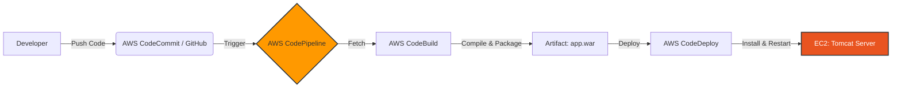

# 🐍 AWS DevOps Snakes: CI/CD Pipeline Edition

 


Welcome to the **Snakes Web Application**! 🎬🐍 
This project demonstrates a production-grade **CI/CD Pipeline** on AWS, deploying a Java Web App to a raw EC2 instance without using managed services like Elastic Beanstalk.

---

## 🚀 Purpose
The goal of this project is to showcase **DevOps best practices** by building a fully automated deployment pipeline.
**Problem Solved**: Manual deployments are slow and error-prone. This project automates the journey from "Code Commit" to "Live Server" in minutes.

---

## 🛠️ Tools & Technologies Used

| Category | Tool | Purpose |
|----------|------|---------|
| **Compute** | **Amazon EC2** (Ubuntu) | Hosting the Tomcat Web Server |
| **Web Server** | **Apache Tomcat 10** | Serving the Java `.war` application |
| **Orchestration** | **AWS CodePipeline** | Managing the CI/CD workflow |
| **Build** | **AWS CodeBuild** | Compiling Java code & packaging artifacts |
| **Deploy** | **AWS CodeDeploy** | Automating deployment to EC2 instances |
| **Scripting** | **Bash Shell** | Lifecycle hooks (`stop_server`, `start_server`) |
| **Language** | **Java 11** | Backend application logic |

---

## 🏗️ The Architecture

We moved away from "ClickOps" to a structured pipeline:



---

## 🚦 Step-by-Step Deployment Approach

Most of the hard work is scripted. Here is how the magic happens:

### 1. **Source Phase** 📝
You push code to your repository. The `buildspec.yml` file tells CodeBuild exactly what to do.

### 2. **Build Phase** (CodeBuild) 📦
*   Provision an Ubuntu build environment.
*   **Fix Line Endings**: Runs `dos2unix` to ensure Windows-edited scripts work on Linux.
*   **Compile**: Runs `build.sh` to compile Java classes.
*   **Package**: Renames `ROOT.war` to `app.war`.

### 3. **Deploy Phase** (CodeDeploy) 🚀
CodeDeploy grabs the artifact and talks to the **CodeDeploy Agent** running on your EC2.
*   **ApplicationStop**: Stops Tomcat service.
*   **Install**: Drops `app.war` into `/opt/tomcat/webapps/`.
*   **Permissions**: Sets owner to `tomcat:tomcat`.
*   **ApplicationStart**: Starts Tomcat service.

---

## 📂 Project Structure

*   `rules/`: **Custom scripts** used by CodeDeploy.
    *   `stop_server.sh`: Safely stops the service.
    *   `start_server.sh`: Brings the app back to life.
*   `buildspec.yml`: The brain of the Build phase.
*   `appspec.yml`: The blueprint for the Deployment phase.
*   `deployment_guide.md`: **[READ THIS FIRST!]** A full manual on setting up the EC2 server and Pipeline.

---

## 🏃‍♂️ How to Run

### Prerequisite: Setup Your Server
Follow the detailed steps in **[deployment_guide.md](deployment_guide.md)** to:
1.  Install Java 21 & Tomcat 10 on Ubuntu.
2.  Install CodeDeploy Agent.
3.  Configure IAM Roles.

### Trigger Deployment
Simply commit a change!
```bash
git add .
git commit -m "New feature: Super fast snakes! 🐍"
git push origin master
```
Go to the **AWS CodePipeline Console** and watch it turn green! ✅

---

### ✨ Authors
Built with ❤️ during the DevOps Masterclass.
